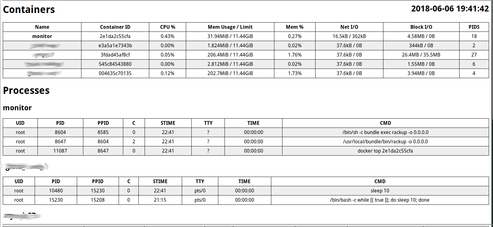

# monidock

Lightweight docker monitoring tool build on Rack




## Features


* Lightweight tool dynamically shows the stats of your running conainers:

* No complex dependencies needed. The tool is built upon a docker client and a rack web server;

* Easy to install and to use. Can be launched in both: on-host and containerized mode.

* Base HTTP Auth available. The credentials can be configured via environment variables.


## Run on your host

**Dependencies**: ruby, docker

```bash

git clone git@github.com:zinovyev/monidock.git monidock

cd monidock

gem install bundler

bundle install

bundle exec rake start # `stop` and `status` commands are also available

```

Always remember to change username and password when running in production.

The values can be configured via environment vairables:

* `MON_NAME` for username (the default value is `monit`);

* `MON_PASSWORD` for password (the default value is `secret`);


## Run in container

**Dependencies**: docker

```bash

git clone git@github.com:zinovyev/monidock.git monidock

cd monidock

docker build -t monidock .

docker run -v /var/run/docker.sock:/var/run/docker.sock --privileged --rm -d \
  -p 9292:9292 \
  -e MON_NAME="monit" \
  -e MON_PASSWORD="12345678" \
  --name monitor docker-monit

```
